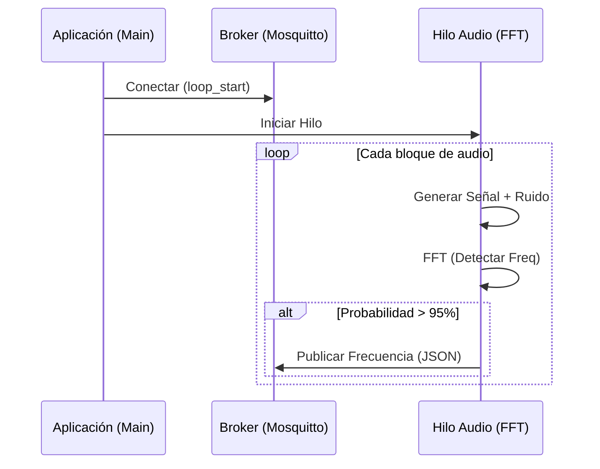

# 🛠️ Documentación de Desarrollo - Flujo Simulado

Este documento explica cómo funciona el flujo de simulación en `src/simulation_flow/index.py` y los requisitos técnicos mínimos para su ejecución.

---

## 🏗️ Plan del Flujo Simulado

La simulación se basa en un modelo de concurrencia de dos hilos:

### 1. Hilo Principal (`Main Thread`)
- **Inicialización MQTT**: Llama a `connect_mqtt()` para abrir un hilo de red (`loop_start()`) y gestionar la conexión con el broker.
- **Configuración GPIO (Mock)**: Configura los pines 17 (LED) y 2 (Botón) usando la factoría `mock`.
- **Bucle de Vida**: Mantiene el proceso activo y gestiona la desconexión limpia (`stop_mqtt()`) al recibir una señal de interrupción (Ctrl+C).

### 2. Hilo de Procesamiento (`Audio Thread`)
- **Generación Sintética**: Crea bloques de audio (`CHUNK_SIZE`) usando una onda senoidal pura de 440Hz mezclada con ruido gaussiano (`np.random.normal`).
- **Análisis de Frecuencia (FFT)**: Aplica una Transformada Rápida de Fourier para detectar la frecuencia dominante en tiempo real.
- **Transmisión de Telemetría**: Si se supera un umbral de probabilidad (5%), envía un mensaje JSON al broker MQTT con la frecuencia detectada.

---

## 📡 Requisitos Mínimos de Conexión

Para que el flujo funcione correctamente, el entorno debe cumplir con lo siguiente:

### 1. Conectividad a Red
- **Acceso a Internet**: El contenedor debe poder resolver y conectarse a `test.mosquitto.org`.
- **Puerto 1883 Abierto**: Tráfico saliente permitido para el protocolo MQTT estándar.

### 2. Configuración de Software
- **Librerías Críticas**:
  - `numpy`: Para cálculos vectoriales y FFT.
  - `paho-mqtt`: Para la comunicación con el broker.
  - `gpiozero`: Para la abstracción de hardware.
- **Factoría Mock**: La variable de entorno `GPIOZERO_PIN_FACTORY=mock` debe estar configurada antes de importar `gpiozero` para evitar errores en sistemas sin pines GPIO físicos.

### 3. Recursos del Sistema (Docker)
- **Memoria RAM**: Mínimo 256MB (recomendado 512MB para evitar cuellos de botella en la FFT).
- **CPU**: 0.5 cores mínimo para mantener la simulación de 44100Hz en tiempo real.

---

## 🔄 Diagrama de Secuencia (Lógica)

